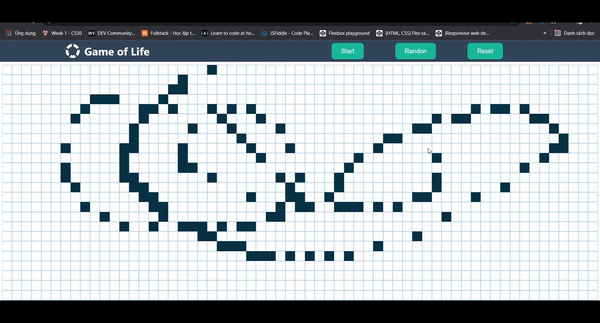

# Wellcome Game Of Life

## Access here:

[https://hoanganhnh.github.io/game-of-life](https://hoanganhnh.github.io/game-of-life)

### `Description`:
The Game of Life, also known simply as Life, is a cellular automaton devised by the British mathematician John Horton Conway in 1970.One interacts with the Game of Life by creating an initial configuration and observing how it evolves. It is Turing complete and can simulate a universal constructor or any other Turing machine.

### `yarn start`

Runs the app in the development mode.\
Open [http://localhost:3000](http://localhost:3000) to view it in the browser.

The page will reload if you make edits.\
You will also see any lint errors in the console.
